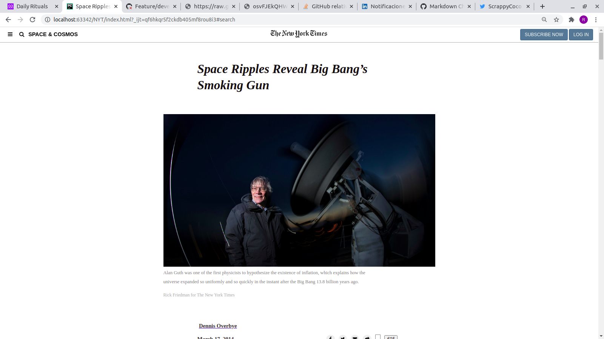

# New York Times Clone

This is a clone of a New York Times article 
(https://www.nytimes.com/2014/03/18/science/space/detection-of-waves-in-space-buttresses-landmark-theory-of-big-bang.html?_r=0).
The code was not copied, instead each feature was observed and redeveloped with the knowledge acquired from the lessons
imparted by the program.

##Built with

- HTML5
- CSS
- FontAwesome

## Getting Started

The project is available in one of the author's [GitHub](https://github.com/RokoVarano/NYT-clone) for cloning.
(https://github.com/RokoVarano/NYT-clone)

Rodrigo Ibaceta Jimenez.

- GitHub: [@RokoVarano](https://github.com/RokoVarano/)
- Twitter: [@RodrigoIbacet11](https://twitter.com/RodrigoIbacet11)
- LinkedIn: https://www.linkedin.com/in/rodrigo-ibaceta-a8657611a/

Manuel Aldaraca

- Github: [@vicmaburrito](https://github.com/vicmaburrito)
- Twitter: [@ManuelAldaraca](https://twitter.com/ManuelAldaraca) 
- LinkedIn: https://www.linkedin.com/in/manuel-aldaraca 

## 🤝 Contributing

Contributions, issues, and feature requests are welcome!

Feel free to check the [issues page](issues/).

## Show your support

Give a ⭐️ if you like this project!

## Acknowledgments

- Hat tip to anyone whose code was used
- Inspiration
- etc

## 📝 License

This project is [MIT](lic.url) licensed